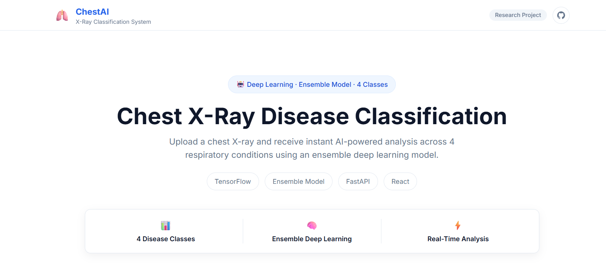
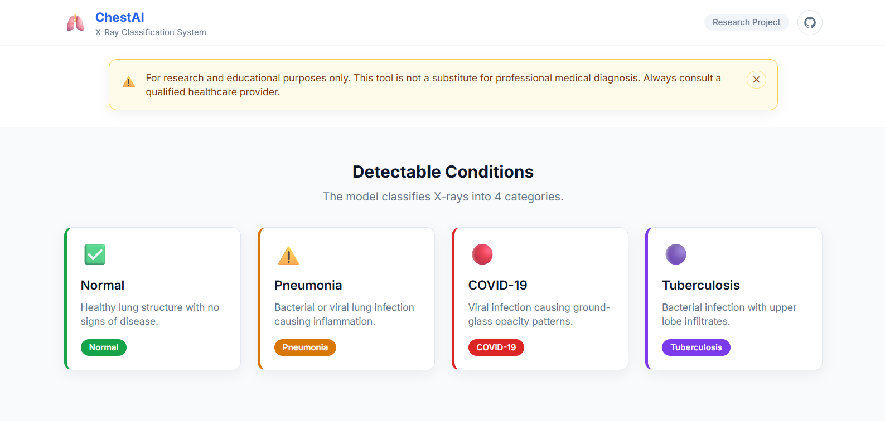
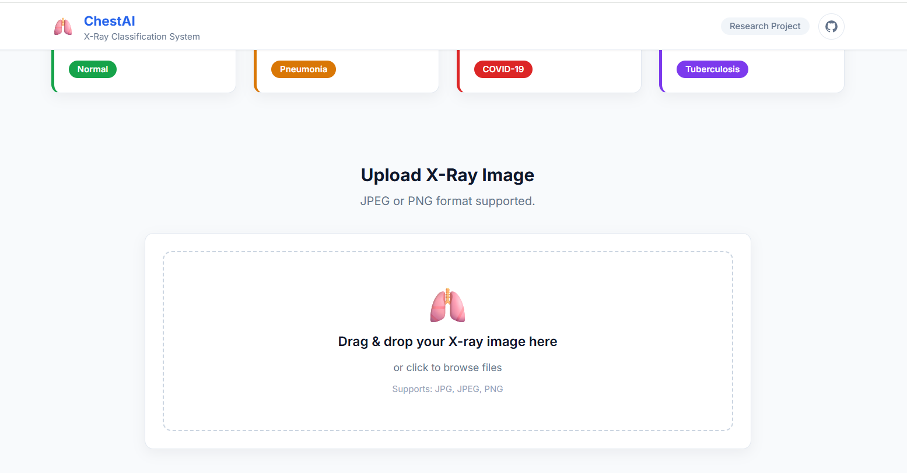
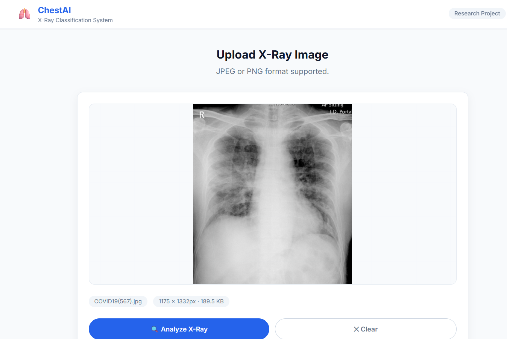
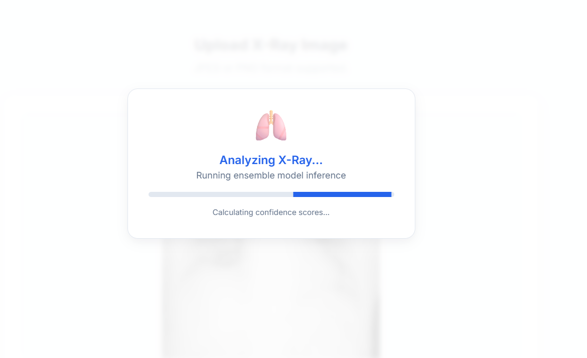
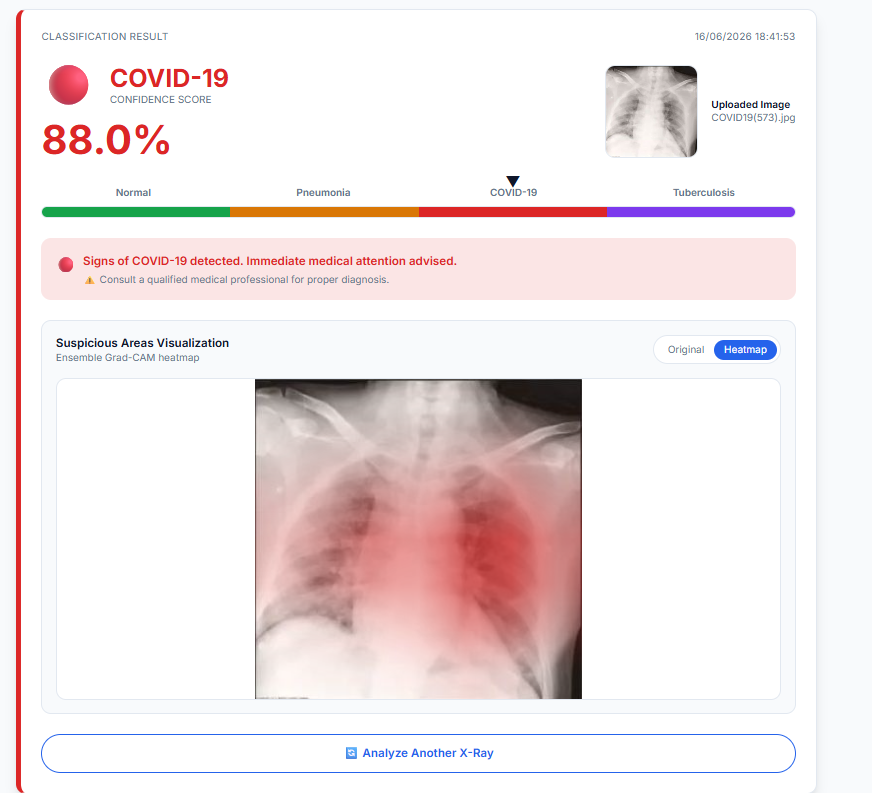
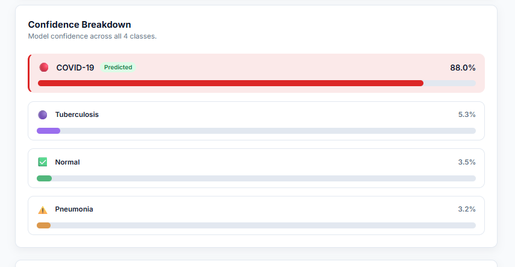
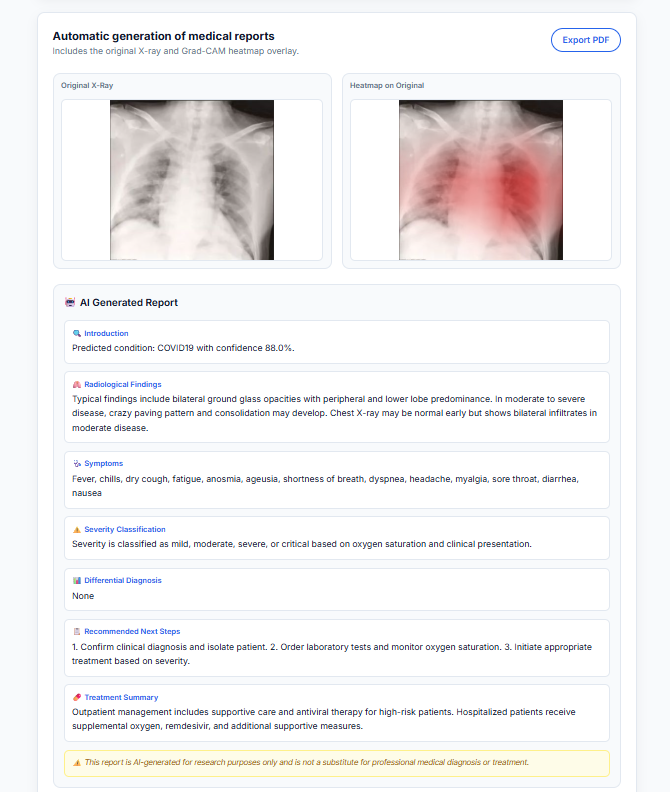

# MedVisionAI
End-to-end chest X-ray analysis platform for classifying respiratory disease, highlighting the most relevant image regions, and generating knowledge-grounded clinical summaries.

## Overview
Chest X-ray interpretation is time-sensitive, high-stakes work, especially in settings where radiology expertise is limited or overloaded. MedVisionAI addresses that gap with a web-based decision-support pipeline that accepts a chest X-ray image, predicts one of four conditions, and returns both a visual explanation and a structured report. The core classifier combines an Advanced ResNet-18 and a ViT-Small model in a weighted ensemble, which improves robustness over either model alone. Beyond prediction, the system adds Grad-CAM-based interpretability and a retrieval-augmented reporting layer so the output is more clinically readable and easier to review.

## Key features
- Weighted ensemble of an Advanced ResNet-18 and a ViT-Small model for stronger classification performance.
- Grad-CAM explainability with ensemble heatmap overlays and localized activation regions.
- Retrieval-augmented generation pipeline for condition-specific medical reporting.
- Class-aware FastAPI backend with file validation, image decoding, and safe error handling.
- Modern React + Vite frontend with upload flow, confidence breakdowns, and report presentation.
- Clean separation between inference, knowledge retrieval, and UI rendering for maintainability.

## Tech stack
- Python 3
- FastAPI
- PyTorch
- torchvision
- timm
- Pillow
- NumPy
- FAISS
- LangChain
- sentence-transformers
- Groq API via OpenAI-compatible client
- dotenv
- React 18
- Vite
- Tailwind CSS
- Framer Motion
- JavaScript / JSX

## Architecture / How it works
1. The user uploads a JPG or PNG chest X-ray through the React frontend.
2. The frontend sends the image to the FastAPI backend at `POST /predict`.
3. The backend validates the file size and type, decodes the image, and runs inference through two separate models: ResNet-18 and ViT-Small.
4. Their softmax outputs are combined using optimized ensemble weights to produce the final class prediction and confidence scores.
5. Grad-CAM is generated from both branches, merged into an ensemble heatmap, and converted into overlay and region data for the UI.
6. A RAG module retrieves class-specific medical context from a FAISS vector store built with sentence-transformer embeddings.
7. A Groq-hosted LLM then turns the retrieved context and model probabilities into a structured clinical report.
8. The frontend displays the prediction, confidence bars, heatmap, and generated report in a clinician-friendly layout.

## Results & performance
The reported model results are based on a held-out test set with 491 images across four classes. The optimized ensemble uses weights of 0.4 for ResNet and 0.6 for ViT.

| Metric | Value |
| --- | ---: |
| Test accuracy | 98.78% |
| Correct predictions | 485 / 491 |
| Errors | 6 |
| Macro F1 score | 0.9888 |
| Ensemble weights | ResNet 0.4 / ViT 0.6 |

| Class | Precision | Recall | F1 | Support |
| --- | ---: | ---: | ---: | ---: |
| COVID-19 | 1.0000 | 0.9767 | 0.9882 | 86 |
| Normal | 0.9932 | 0.9800 | 0.9866 | 150 |
| Pneumonia | 0.9675 | 0.9933 | 0.9803 | 150 |
| Tuberculosis | 1.0000 | 1.0000 | 1.0000 | 105 |

## Screenshots / Demo
### 1. Interface Overview




### 2. Upload X-ray





### 3.Predections results and confidence score




### 6.Clinical Report Output


## Installation & usage
### 1. Clone the repository
```bash
git clone https://github.com/M-Amine-HM/MedVisionAI
cd MedVisionAI
```

### 2. Set up the backend
```bash
cd backend
python -m venv .venv
.venv\Scripts\activate
pip install -r requirements.txt
```

### 3. Configure the environment
Create a `.env` file in `backend/` and add your Groq API key:
```env
GROQ_API_KEY=your_api_key_here
```

### 4. Start the backend server
```bash
uvicorn main:app --reload --host 0.0.0.0 --port 8000
```

### 5. Set up the frontend
Open a second terminal:
```bash
cd frontend
npm install
npm run dev
```

### 6. Open the application
Visit:
```bash
http://localhost:5173
```

The frontend is configured to proxy `/predict` requests to the backend at `http://localhost:8000`.

## Project structure
```text
MedVisionAI/
├─ backend/
│  ├─ main.py
│  ├─ inference.py
│  ├─ rag.py
│  ├─ requirements.txt
│  ├─ medical_docs/
│  │  ├─ covid19.txt
│  │  ├─ normal_chest.txt
│  │  ├─ pneumonia.txt
│  │  └─ tuberculosis.txt
│  └─ model/
│     ├─ models/
│     │  ├─ best_resnet18_advanced.pth
│     │  └─ best_vit_advanced.pth
│     └─ results/
│        └─ ensemble_results.json
├─ frontend/
│  ├─ index.html
│  ├─ package.json
│  ├─ vite.config.js
│  └─ src/
│     ├─ App.jsx
│     ├─ main.jsx
│     ├─ index.css
│     └─ components/
├─ report/
│  ├─ main.tex
│  └─ figures/
├─ docs/
├─ notebook.ipynb
└─ README.md
```

## Authors
 GitHub | LinkedIn |
 --- | --- |
 https://github.com/M-Amine-HM | https://www.linkedin.com/in/mohamedaminehm/ |

## Disclaimer
This project is for research and educational purposes only and is not a substitute for professional medical diagnosis or treatment.
